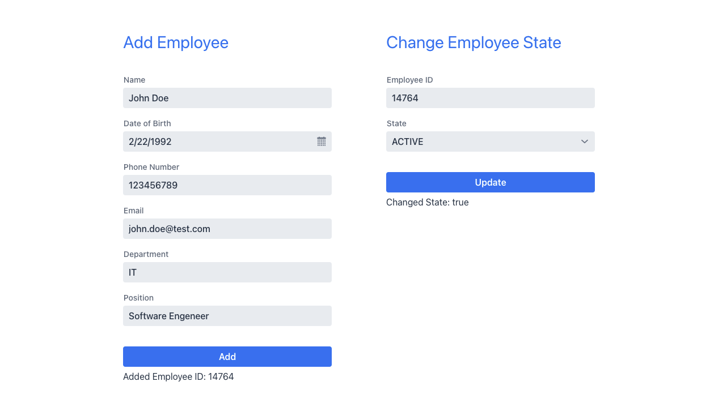

# Spring Boot Demo App using microservices

A Demo project showcasing the architecture and functionality of a Spring Boot based application which exposes 
two RESTful endpoints and a WebApp in the form of "employee management". It uses ArangoDB as a Database and is containerized and ran using Docker.

## Getting started

In order to run this app you need to have the following installed:

- [Git](https://git-scm.com)
- [Docker](https://docs.docker.com/engine/installation/)

## Installation

Clone this repo to your machine:

```
git clone https://gitlab.com/nutridia/project.git peopleflow
```

### Services
Currently, the app contains two microservices:

1. employee - the main logic where two RestFULL endpoints are exposed for adding a new employee and updating the state of one.
2. employee-ui - ui that exposes the functionality of the system on the web and acts as a client using the RESTful API.

## Running the App
The application is containerized using Docker.<br>

First make sure ArangoDB is up and running:
```
docker-compose -f docker-compose-system.yml up
```

Then start the services
```
docker-compose -f docker-compose-microservices.yml up
```
The **docker-compose-microservices.yml** might take some time on the first run as it has to download all mvn dependencies

(All commands are run from the project folder)

## Database Administration & Dashboard
Once **docker-compose-system.yml** is running it's possible to connect to the database administration UI. Open your browser to:
```
http://localhost:8529
```

Unless you have changed the settings, the username and password during development will be:

- User: root
- Password: (empty)

After the login and upon adding the first employee a database called "peopleflow-employees" will be created.
From the ArangoDB you can explore it and see all the changes to the database which will be made on the REST endpoints.

##REST Endpoint Documentation
Once **docker-compose-microservices.yml** is running you can view the API documentation for the "employee" microservice. Open your browser to:
```
http://localhost:8081/swagger-ui.html
```

Here you can view and try the REST API exposed. The JSON structured API specification can be found by visiting:
```
http://localhost:8081/v2/api-docs
```

##Employee UI
Once **docker-compose-microservices.yml** is running you can view the Employee UI WebApp. Open your browser to:
```
http://localhost:8082
```
After you add an employee bellow the "Add" button the ID of the employee will be shown, then you can use this id to update the state of the same employee.



##Testing
The "employee" microservice contains a single test that invokes both REST endpoints and tests if the use-cases work.
1. First it mocks a request to the "addEmployee" endpoint and checks if the record is successfully added to the DB. 
2. Then changes the same employee's state by calling "setEmployeeState" and checks if the record is updated successfully.
3. After which it deletes the same record.

Note: in order for the test to run successfully **docker-compose-system.yml** must be running.<br>
(Additional tests can be added for data entry validation once it's implemented)
